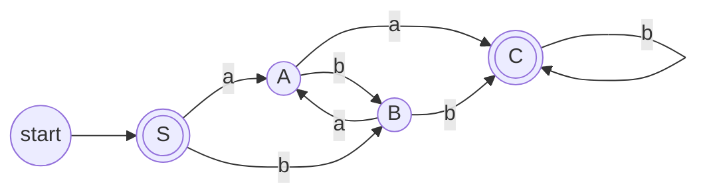

<h1 align="center">📝 Aula 4 — Hierarquia de Chomsky e Gramáticas Regulares</h1>

  <a href="../README.md">Home</a>&nbsp;&nbsp;&nbsp;|&nbsp;&nbsp;&nbsp;
  <a href="#-resumo">Resumo</a>&nbsp;&nbsp;&nbsp;|&nbsp;&nbsp;&nbsp;
  <a href="#-conteúdo-abordado">Conteúdo</a>&nbsp;&nbsp;&nbsp;|&nbsp;&nbsp;&nbsp;
  <a href="#-exercício-prático">Exercício Prático</a>&nbsp;&nbsp;&nbsp;|&nbsp;&nbsp;&nbsp;
  <a href="#-materiais-da-aula">Materiais</a>

---

## 📜 Resumo
Esta aula introduz a Hierarquia de Chomsky, uma classificação fundamental que organiza gramáticas formais e as linguagens que elas geram em quatro níveis de complexidade. O foco principal é o nível mais restrito, as **Gramáticas Regulares (Tipo 3)**, e sua relação direta com os Autômatos Finitos.

## 🔍 Conteúdo abordado
### 1. Hierarquia de Chomsky
* **O que é?** Uma classificação de gramáticas formais e das linguagens que elas geram em quatro níveis, do mais restritivo (Tipo 3) ao mais geral (Tipo 0). Cada nível tem regras específicas para suas produções e um tipo de autômato correspondente que reconhece a linguagem.
* **Tipos de Gramáticas:**
    * **Tipo 3: Gramáticas Regulares:** Produções do tipo `A → aB` ou `A → a` (lineares à direita). As linguagens geradas são as **Linguagens Regulares**, e o reconhecedor é o **Autômato Finito (AFD ou AFN)**.
    * **Tipo 2: Gramáticas Livres de Contexto:** Produções do tipo `A → γ`, onde A é um não-terminal e γ é uma cadeia de terminais e não-terminais. São reconhecidas por **Autômatos com Pilha**.
    * **Tipo 1: Gramáticas Sensíveis ao Contexto:** Produções do tipo `αAβ → αγβ`, onde `A` é não-terminal e `α`, `β` são contextos que não podem ser alterados. São reconhecidas por **Autômatos Linearmente Limitados**.
    * **Tipo 0: Gramáticas Irrestritas:** Produções do tipo `α → β`, onde `α` e `β` são cadeias arbitrárias. São reconhecidas por **Máquinas de Turing**.
* **Importância:** A hierarquia define os limites computacionais e o poder de cada modelo, sendo fundamental para áreas como o desenvolvimento de compiladores (usando GLCs) e a verificação de protocolos (usando Linguagens Regulares).

---

## 💻 Exercício Prático
### Descrição
Dada a seguinte gramática regular e seu autômato finito correspondente, valide se as 5 palavras são aceitas.

Gramática Regular (Tipo 3)  
S -> aA | bB | ε  
A -> bB | aC | ε  
B -> aA | bC | ε  
C -> bC | aC | a | b

### Resolução
Para validar cada palavra, rastreamos sua computação através do autômato, começando no estado inicial `S`. A palavra é aceita se a computação termina em um dos estados finais (`S` ou `C`) após a leitura de todos os símbolos.

1.  **Palavra: `abbababab`**
    -   `S` --a--> `A`
    -   `A` --b--> `B`
    -   `B` --b--> `C`
    -   `C` --a--> `C`
    -   `C` --b--> `C`
    -   `C` --a--> `C`
    -   `C` --b--> `C`
    -   `C` --a--> `C`
    -   `C` --b--> `C`
    -   **Resultado:** A computação termina no estado `C`, que é um estado final. Portanto, a palavra é **aceita**.

2.  **Palavra: `bababbaaba`**
    -   `S` --b--> `B`
    -   `B` --a--> `A`
    -   `A` --b--> `B`
    -   `B` --a--> `A`
    -   `A` --b--> `B`
    -   `B` --b--> `C`
    -   `C` --a--> `C`
    -   `C` --a--> `C`
    -   `C` --b--> `C`
    -   `C` --a--> `C`
    -   **Resultado:** A computação termina no estado `C`, que é um estado final. Portanto, a palavra é **aceita**.

3.  **Palavra: `ababaabbab`**
    -   `S` --a--> `A`
    -   `A` --b--> `B`
    -   `B` --a--> `A`
    -   `A` --b--> `B`
    -   `B` --a--> `A`
    -   `A` --a--> `C`
    -   `C` --b--> `C`
    -   `C` --b--> `C`
    -   `C` --a--> `C`
    -   `C` --b--> `C`
    -   **Resultado:** A computação termina no estado `C`, que é um estado final. Portanto, a palavra é **aceita**.

4.  **Palavra: `ababaabbab`**
    -   Esta é uma repetição do item 3. A análise é a mesma, resultando em **aceitação**.

5.  **Palavra: `aabbababaa`**
    -   `S` --a--> `A`
    -   `A` --a--> `C`
    -   `C` --b--> `C`
    -   `C` --b--> `C`
    -   `C` --a--> `C`
    -   `C` --b--> `C`
    -   `C` --a--> `C`
    -   `C` --b--> `C`
    -   `C` --a--> `C`
    -   `C` --a--> `C`
    -   **Resultado:** A computação termina no estado `C`, que é um estado final. Portanto, a palavra é **aceita**.

---

## 📎 Materiais da Aula
-   [**PDF da Aula 4 - Hierarquia de Chomsky e Gramáticas Regulares**](slides/Aula04_Chomsky-GramaticasRegulares.pdf)
