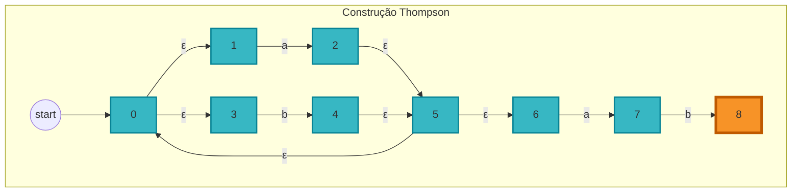

<h1 align="center">📝 Aula 5 — Conversão de Expressões Regulares (ER) para AFN/AFD</h1>

  <a href="../README.md">Home</a>&nbsp;&nbsp;&nbsp;|&nbsp;&nbsp;&nbsp;
  <a href="#-resumo">Resumo</a>&nbsp;&nbsp;&nbsp;|&nbsp;&nbsp;&nbsp;
  <a href="#-conteúdo-abordado">Conteúdo</a>&nbsp;&nbsp;&nbsp;|&nbsp;&nbsp;&nbsp;
  <a href="#-exercício-prático">Exercício Prático</a>&nbsp;&nbsp;&nbsp;|&nbsp;&nbsp;&nbsp;
  <a href="#-materiais-da-aula">Materiais</a>

---

## 📜 Resumo
Esta aula se dedica aos algoritmos que demonstram a equivalência entre Expressões Regulares (ER) e Autômatos Finitos (AF). O material descreve como construir um Autômato Finito Não Determinístico (AFN) a partir de uma ER e, em seguida, como converter esse AFN para um Autômato Finito Determinístico (AFD) equivalente.

## 🔍 Conteúdo abordado
### 1. Equivalência entre ER e Autômatos Finitos
* **Conceito:** Uma linguagem é **regular** se, e somente se, ela pode ser descrita por uma Expressão Regular ou aceita por um Autômato Finito (AFD ou AFN). Essa equivalência é um pilar da teoria de linguagens formais.
* **Processo de Conversão:** A tradução de uma ER para um AFD é geralmente feita em duas etapas para simplificar o processo:
    1.  **ER para AFN:** Um algoritmo de construção, como a **Construção de Thompson**, é usado para criar um AFN a partir da ER. Este autômato intermediário pode conter `ε-transições` (movimentos vazios), que são transições de um estado para outro sem consumir um símbolo de entrada.
    2.  **AFN para AFD:** O **Método da Construção de Subconjuntos** é então aplicado para converter o AFN para um AFD equivalente. O objetivo é eliminar o não-determinismo, criando novos estados no AFD que correspondem a conjuntos de estados no AFN original.

### 2. Construção de Thompson (ER → AFN)
* **Objetivo:** Gerar um AFN com apenas um estado inicial e um estado final a partir de uma ER.
* **Passos:** A construção é feita de forma indutiva, combinando os AFNs de subexpressões menores.
    * **Expressão `a`**: Um AFN com dois estados conectados por uma transição com o símbolo `a`.
    * **Concatenação `rs`**: O estado final do AFN de `r` é ligado por uma `ε-transição` ao estado inicial do AFN de `s`.
    * **União `r|s`**: Um novo estado inicial é criado com `ε-transições` para os estados iniciais de `r` e `s`. Os estados finais de `r` e `s` são ligados por `ε-transições` a um novo estado final global.
    * **Fecho de Kleene `r*`**: Envolve a criação de um novo estado inicial e final, com `ε-transições` para suportar zero ou mais repetições da expressão `r`.

---

## 💻 Exercício Prático
### Descrição
Considere a Expressão Regular `(a|b)*ab` sobre o alfabeto `{a, b}`.

1.  Converta esta Expressão Regular para um Autômato Finito Não Determinístico (AFN) usando o método da **Construção de Thompson**.
2.  Converta o AFN resultante para um Autômato Finito Determinístico (AFD) equivalente usando o método da **Construção de Subconjuntos**.

### Resolução

#### 1. Conversão para AFN (Construção de Thompson)

A expressão `(a|b)*ab` é a concatenação de duas subexpressões: `(a|b)*` e `ab`.
-   Primeiro, construímos o AFN para a união `a|b`.
-   Em seguida, aplicamos o fecho de Kleene para obter `(a|b)*`.
-   Depois, construímos o AFN para a concatenação `ab`.
-   Finalmente, concatenamos os AFNs de `(a|b)*` e `ab`.

**AFN Resultante para `(a|b)*ab`:**

## 📎 Materiais da Aula
-   [**PDF da Aula 5 - Conversão de Expressões Regulares (ER) para AFN/AFD**](slides/Aula05_ER-AFNe.pdf)

